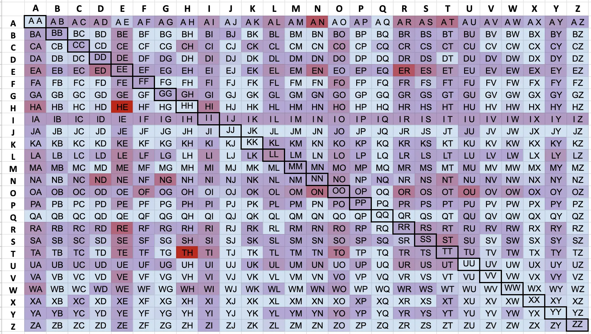

# Word and Character Frequency Counts

## MDickens Personal Data
An informal analysis, but one of my favorites. Contains character frequency analyses both including and not including coding text in the input corpus. It also has some word frequency AND symbol frequency! Symbol frequency can be surprisingly hard to find.
https://mdickens.me/typing/letter_frequency.html 

## Lydell Bigram Frequencies
bigram frequencies along with the code of how he did it - very useful
https://gist.github.com/lydell/c439049abac2c9226e53

## Google Books Ngram Project
Many downloadable files containing info on how often different Ngrams occur in the google corpus. 

Incredible amount of data, but presented very unintuitively. Largely unhelpful imo
http://storage.googleapis.com/books/ngrams/books/datasetsv2.html

## Peter Norvig Data Analysis
Peter took the Google Ngram data and made it useful. Basically a distillation of all the important stuff you would want to know, presented in a much more helpful format. Much better.
http://norvig.com/mayzner.html

## UCREL Data
Very interesting site with several frequency lists for both written and spoken English, broken down in several ways which are not commonly found in other data.

The simplest and most directly applicable to keyboard typing is the [Word Frequency In Written English](https://ucrel.lancs.ac.uk/bncfreq/lists/2_3_writtenspoken.txt) list.
https://ucrel.lancs.ac.uk/bncfreq/flists.html

## Vivian Cook Data
What can we say about Vivian Cook. Idk who this woman is, or why she put this data together. Her website is terrible. But her data is incredible.

http://www.viviancook.uk/Punctuation/PunctFigs.htm
Punctuation frequency

http://www.viviancook.uk/SpellStats/LetFreqByWordPosition.html
Frequency of letter position in word (this is very hard to find elsewhere!)

http://www.viviancook.uk/SpellStats/ContactLetFreqs.html
contact chart (how often two letters touch each other)

I made this bigram heatmap using her contact chart data.  

# Corpora Links
The [English Corpora](https://www.english-corpora.org/) website will allow you to browse and download a lot of different corpora like the [Wikipedia Corpus](https://www.english-corpora.org/wiki/) or the [Corpus of American Soap Operas](https://www.english-corpora.org/soap/)

They don't have everything, and some cost money. So here are some other options:
- [British National Corpus](http://www.natcorp.ox.ac.uk/)
- [American National Corpus](https://anc.org/)
- [Standardized Project Gutenberg Corpus](https://github.com/pgcorpus/gutenberg)
